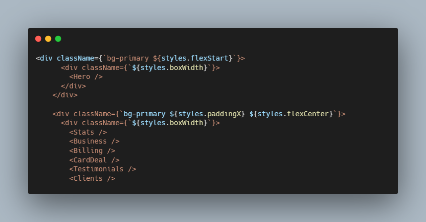

# HooBank - The Next Generation Payment System

### Description

Hoobank, the next generation of payment systems. This modern bank app was created using Javascript, React, Tailwind styling and Vite for rich features and access to universal plugins. With a strong focus on UI. Hoobank is a fully responsive web application. Utilising postcss, vite and autoprefix to style more dynamically and at a faster pace

### Technology

- Javascript
- Vite
- Reactjs
- PostCSS
- Tailwind CSS

### How to use

### Code Snippet

### Links

For more of my work visit:

---

---

[Personal Profile](https://perrellshaw.netlify.app/)

# hoobank-payment-application
